# Java Application CI/CD Pipeline with Jenkins, Docker, Terraform, ECR, and EKS

## Overview

This project outlines the steps to establish a CI/CD pipeline for a Java application. Starting with manual deployment to grasp the environment's nuances, we transitioned to automation, leveraging Jenkins for the primary tasks.

Here's a brief on the tools we integrated:

- **Jenkins**: The backbone of our CI/CD, Jenkins managed both build and deployment, ensuring quick feedback loops and dependable builds.
- **Docker**: Containerizing the Java application ensured environment uniformity across development, staging, and production.
- **AWS ECR**: We used Amazon's ECR to store our Docker images, tapping into its scalability and seamless AWS service integration.
- **AWS EKS**: We opted for Amazon's EKS for Kubernetes due to its managed infrastructure, security features, and robust AWS compatibility.
- **Terraform**: To codify and automate our EKS infrastructure provisioning, we utilized Terraform, capitalizing on its idempotency and versioning capabilities.

## Iteration 1: Environment Setup


- **Clone the Project**: `git clone https://github.com/gfakx/JavaApp-Jenkins-Docker-ECR-EKS.git`
- **Prepare Installation Script**: `chmod +x dependency-installation.sh`  
- **Execute Script** : `./dependency-installation.sh`

## Iteration 2: Dockerization 
### Objective:
Prepare the application for containerization.  
- **Locate Dockerfile**: `cd JavaApp-jenkins-docker-ecr-eks`
- **Build Docker Image**: `docker build -t [desired_image_name]:[desired_tag] .`
- **Test Docker Container Locally:** 
  - Build the Docker image.
  - Run the container.
  - `docker run -p 8080:8080 [desired_image_name]:[desired_tag]`
  - Navigate to http://localhost:8080 to validate the application.  

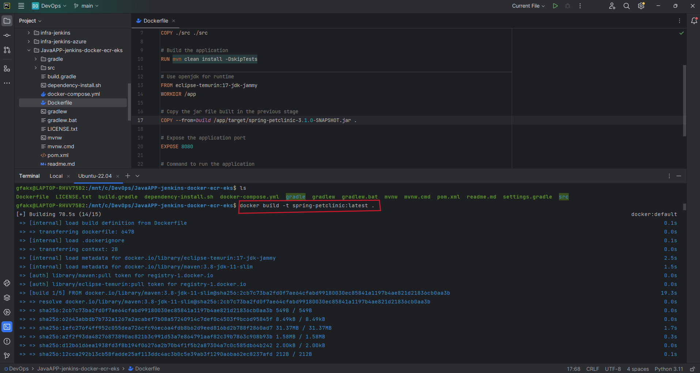
img 2.a  

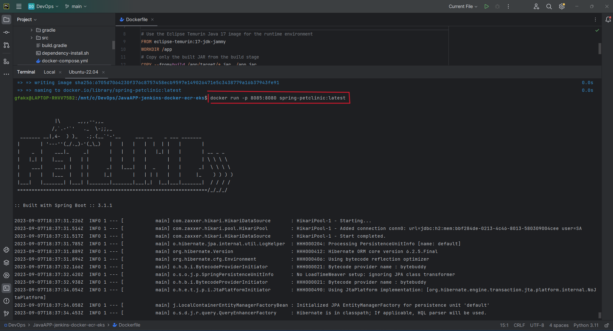
img 2.b  

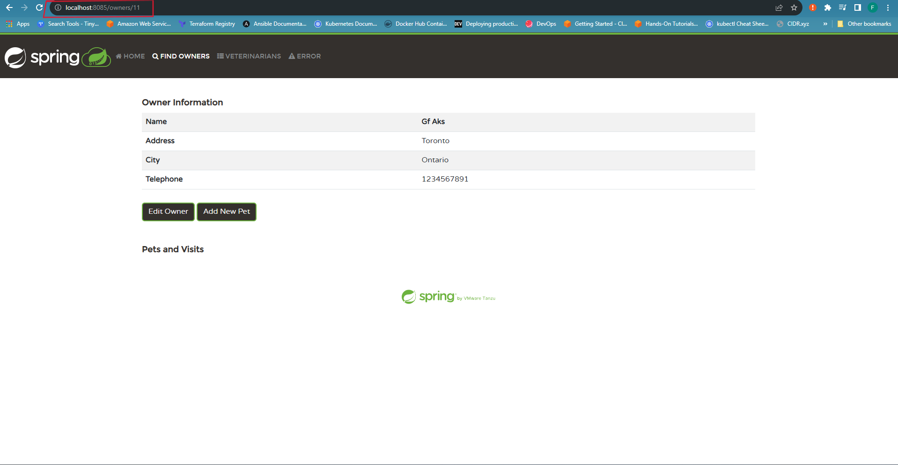
img 2.c


## Iteration 3:  Push to ECR
###Objective:
Migrate Docker images to AWS ECR.
- **Create an ECR Repository**: `aws ecr create-repository --repository-name [repository_name]`
- **Authorize Docker with ECR:**: `aws ecr get-login-password --region [region] | docker login --username AWS --password-stdin [account_id].dkr.ecr.[region].amazonaws.com`
- **Tag Docker Image**: `docker tag [desired_image_name]:[desired_tag] [account_id].dkr.ecr.[region].amazonaws.com/[repository_name]:[desired_tag]`
- **Push Docker Image**: `docker push [account_id].dkr.ecr.[region].amazonaws.com/[repository_name]:[desired_tag]`

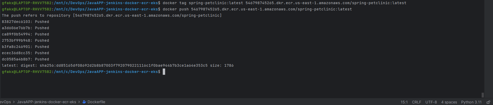
img 3.a

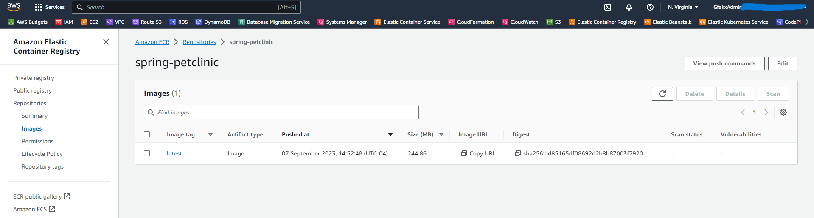
img 3.b
## Iteration 4:  Setting up the Kubernetes Cluster with Terraform

- **Locate `main.tf` in root directory**
- Adjust Terraform configurations to set up the EKS cluster.
- **Initiate Terraform**:
```bash
terraform init 
terraform fmt 
terraform validate
terraform plan
terraform apply
```
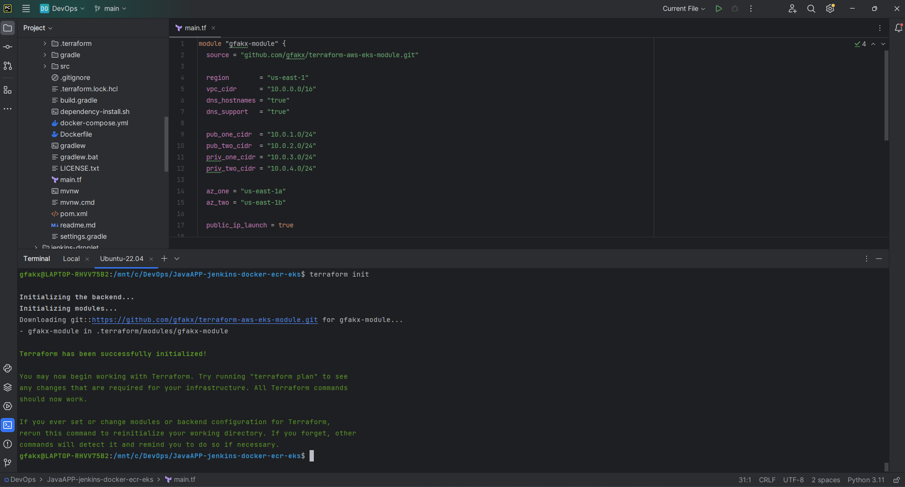
img 4.a
## Iteration 5:   Kubernetes Deployment
### Objective:
Deploy to Kubernetes on AWS EKS manually.
- **Create Kubernetes Manifest** `spring-petclinic-deployment.yaml`
- **Applying these manifests to the EKS cluster** : `kubectl apply -f spring-petclinic-deployment.yaml`
- **Retrieve LoadBalancer URL**
  - Once the service is created, it might take a few minutes for the LoadBalancer to be provisioned and the URL to be available.
  - Use the command `kubectl get svc` to retrieve the external URL of the LoadBalancer.
- **Test the Application**
  - Open the LoadBalancer URL in a browser or use tools like curl to access the application and ensure it's serving content as expected.
  
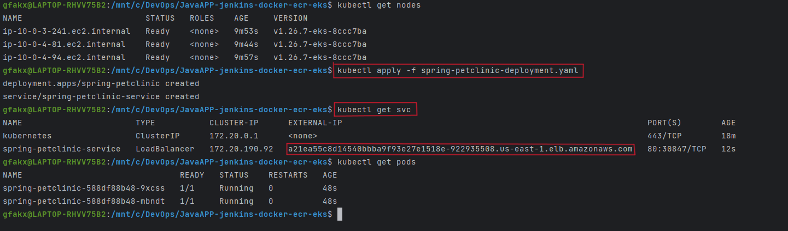
img 5.a

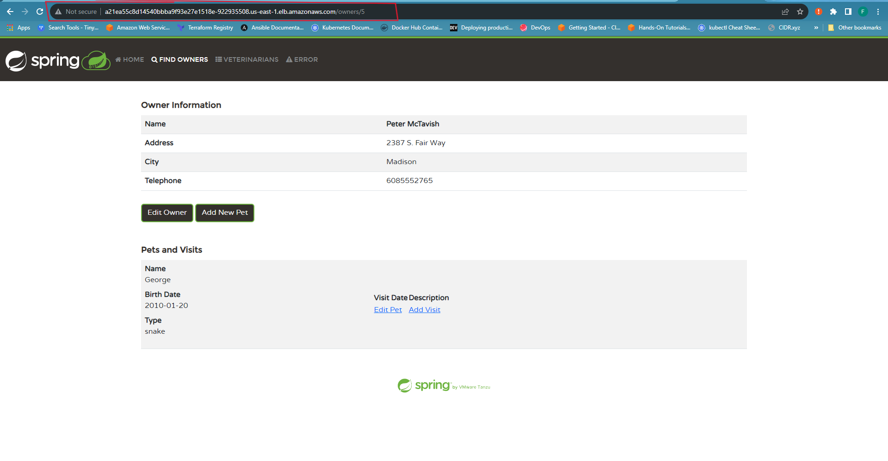
img 5.b
## Iteration 6:   Automating Deployment to AWS EKS using Jenkins
### Objective:
Full automation of deployment.
- **Ensure Jenkins is installed and running:** ` systemctl status jenkins`
- **Login to Jenkins Server After Installation**
- **Install Essential Plugins:** This includes Docker, AWS CLI, Kubernetes, and others.
- **Configure Global Credentials in Jenkins**:Jenkins will need permissions to push images to ECR and update deployments in EKS.
- **Jenkins Job Creation:** Create a new Jenkins job (Pipeline type) for the deployment process.
- **Create a Jenkinsfile**: Locate the Jenkinsfile in the root directory and configure accordingly 
- **Run the  Jenkins Pipeline**
- **Test Deployment**: Run `kubectl get svc` to get loadbalancer dns.  

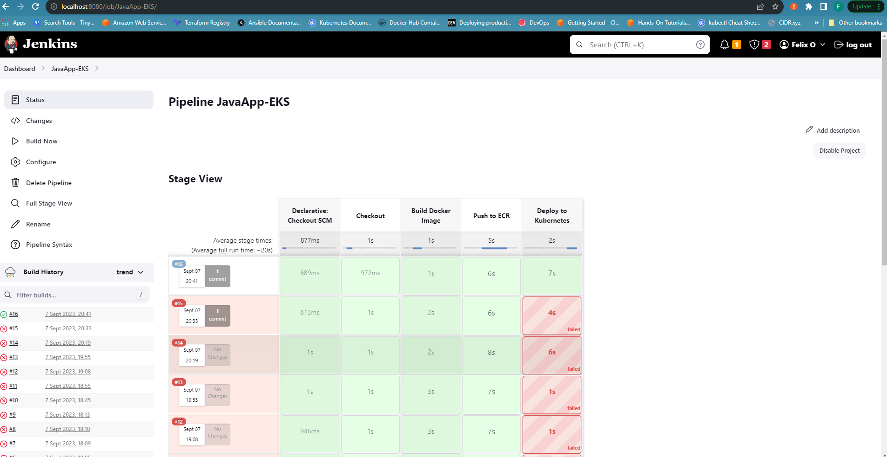
img 6.a

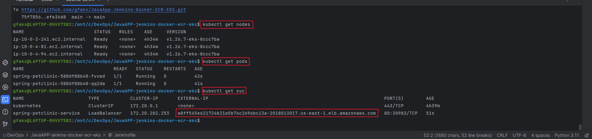
img 6.b

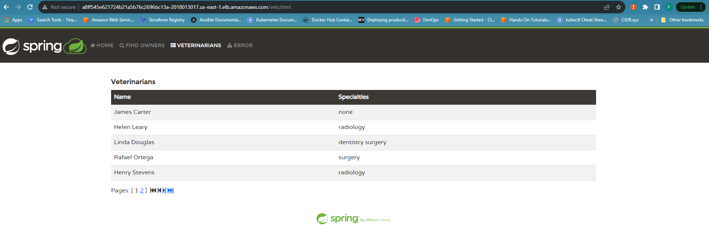
img 6.c

This guide is aimed at providing a concise, straightforward path to deploy a Java application using an array of industry-leading tools. Happy deploying!